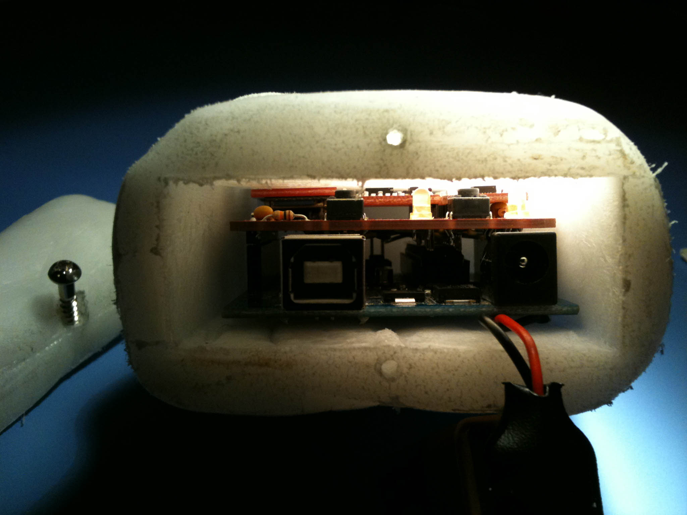

The FutureHand was inspired by Pranav Mistry's 2009 [TED
talk](https://www.youtube.com/watch?v=YrtANPtnhyg) on the Sixth Sense device.
I was interested in exploring novel human computer interfaces and felt that the
ubiquitous 2-DOF mouse could be augmented to instead operate in 6 dimensions:
the 3 translational (x, y, z) and the 3 rotational dimensions (yaw, pitch,
roll).

The FutureHand is a home-brew inertial measurement unit (IMU) integrated into a
bluetooth USB device. A pair of gyroscopes were used to capture rapid rotational
changes, as well as measure the absolute rotations through dead reckoning. An
accelerometer and magnetometer were used to measure translational changes, as
well as combined with the gyroscope rotation estimates through complementary
filters to allow for more accurate absolute rotations.  

The FutureHand was then augmented with a Bluetooth chip, and inserted into a
custom molded case, allowing for easy use as a 6-DOF mouse. This novel
controller was integrated into the [Moonweasel]() project, the 3-dimensional space flight simulator, allowing for more
precise flight control.

